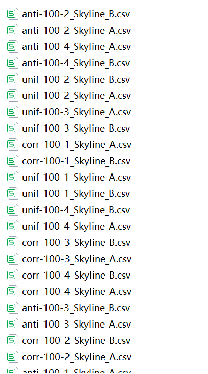
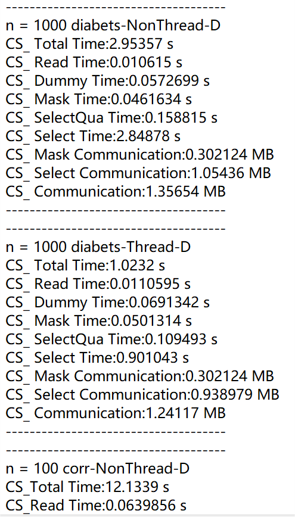

# Skyline-PPSQ
The source code is located in ./test/test_ring_skyline.cpp

## Introduction:

run the code:

`cd ./build/`

`cmake -DCMAKE_INSTALL_PREFIX=./install .. -DBUILD_TESTS=ON -DBUILD_NETWORKS=ON`

`cmake --build . --target install --parallel`

the "skyline-OT.o" file is generated. 

Please move to the "run" file:

`cd /build/bin/`

Note: To test the files, we prepared the relevant executables, where "skyline-OT-G" stands for model generation, ""skyline-OT-Q" for model query under synthetic datasets (where -T is for parallel execution), and ""skyline-OT-Qdo" for real datasets (where -T is for parallel execution). 
Moreover, we construct shell files where: 

1. "Pname" denotes the dataset by  (0 to 2, representing three datasets：corr, anti, inde),
2. "Psize" denotes the size of the dataset (0 to 6, representing (10, 100, 1000, 3000, 5000, 7000, and 9000)),

## Run test example:

For example, run the command.

`nohup ./run.sh >output.txt 2>&1 &`

, the whole console output is stored in "output.txt".

## Other test

Since the other datasets exceed the 25M size limit of the "Github" website, we only uploaded "size=100" under synthetic datasets and "size=1000" under real dataset as open source material.

For the dataset under "size=1000":

1. You can execute individually the following command:`./skyline-OT-G r=1 p=9000 Pname=0 Psize=2 & ./skyline-OT-G r=2 p=9000 Pname=0 Psize=2`

   1. the test result is generated in the following file: ./test/out_A.txt, ./test/out_B.txt. For example:

      

   2. the parameter result is stored in ./test/grid/Pname-Psize-*.csv

      

2. You can also execute individually the following command:`./skyline-OT-Q r=1 p=9000 Pname=0 Psize=2 & ./skyline-OT-Q r=2 p=9000 Pname=0 Psize=2`

   1. the test result is generated in the following file: ./test/out_A_qua.txt, ./test/out_B_qua.txt

   2. The Skyline Mask (polynomials and hash functions) Time, SelectQua (quadrant) Query Time, Select (dynamic) Query  Time, and Communication are printed. For example:

      
